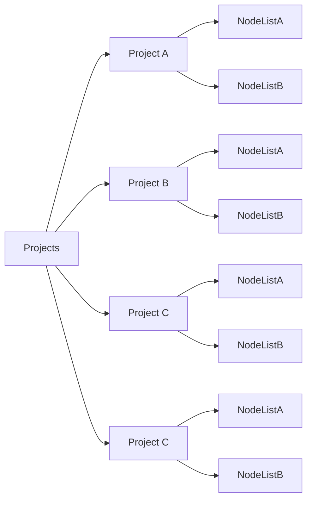
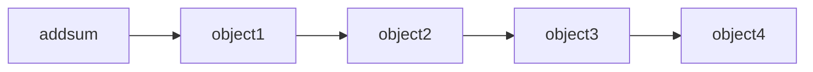

# Light-Blue-Cross
# 蓝十字会的技术架构

*   宗旨：不想让红十字会花钱不走心！

## NodeListA

## NodeListB

## 核心架构

* 说白了，就是如何接受捐款，如何花销款项

### 捐款

* 财务队列

### 花销

* 财务队列

## 节点数据结构

捐款ID

捐款人ID

捐款时间

捐款数额

捐款余额

## 花销数据节点

花销ID

花销项目ID

## 骚操作

* 收到捐款：回复，现金余额
* 花费的时候：告知开始某一个援助，花费多少，占比多少
* 花费完成：告知成果
* log：可查询的log

